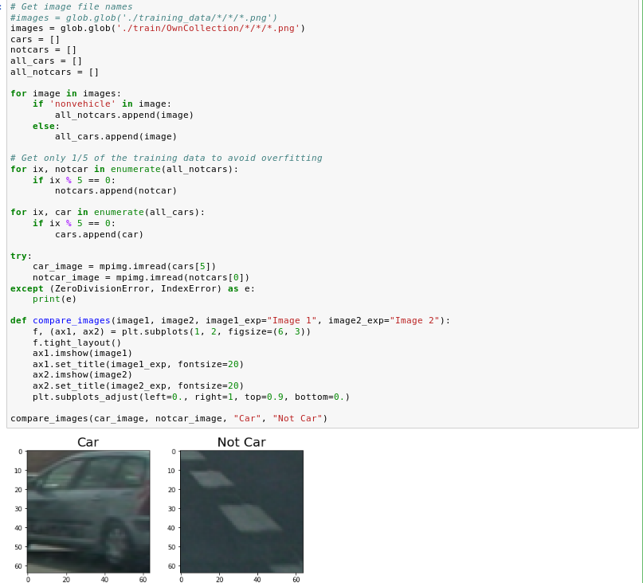
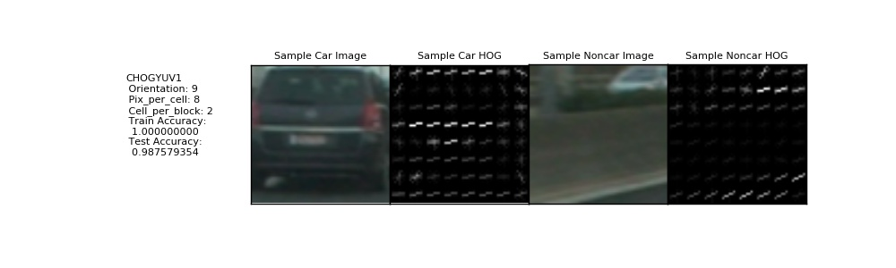
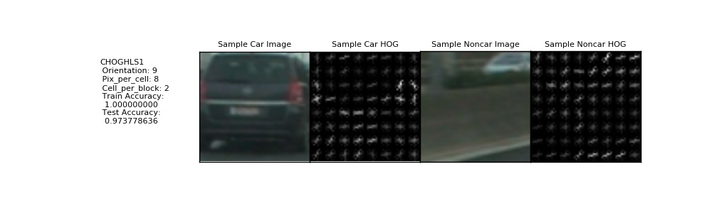
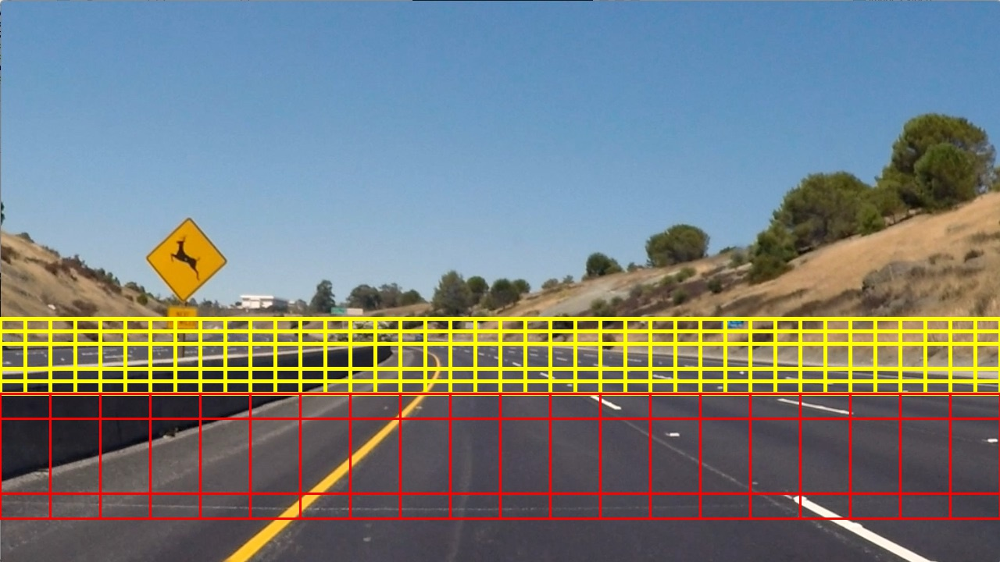
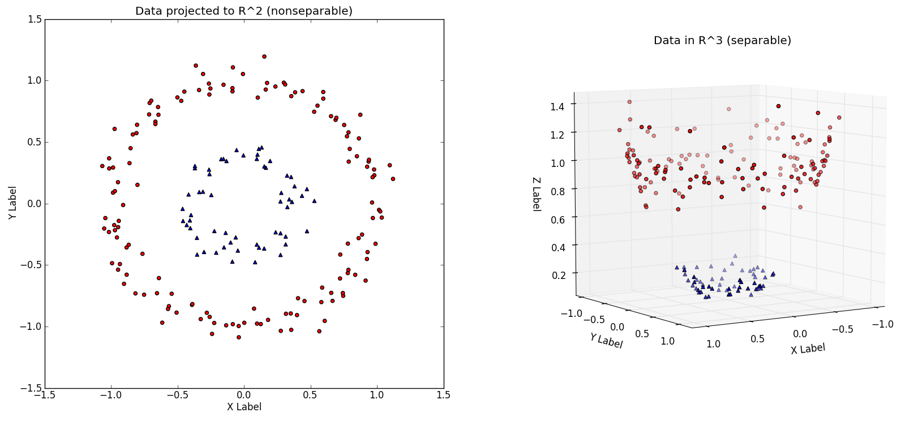
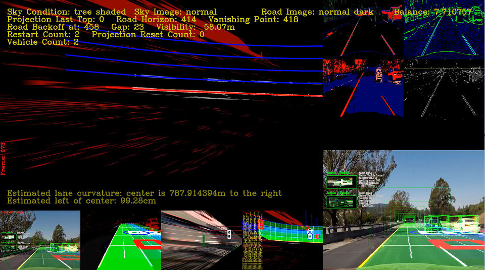

# Vehicle Detection

The Project
---

The goals / steps of this project are the following:

* Perform a Histogram of Oriented Gradients (HOG) feature extraction on a labeled training set of images and train a classifier Linear SVM classifier
* Optionally, you can also apply a color transform and append binned color features, as well as histograms of color, to your HOG feature vector. 
* Note: for those first two steps don't forget to normalize your features and randomize a selection for training and testing.
* Implement a sliding-window technique and use your trained classifier to search for vehicles in images.
* Run your pipeline on a video stream (start with the test_video.mp4 and later implement on full project_video.mp4) and create a heat map of recurring detections frame by frame to reject outliers and follow detected vehicles.
* Estimate a bounding box for vehicles detected.

Here are links to the labeled data for [vehicle](https://s3.amazonaws.com/udacity-sdc/Vehicle_Tracking/vehicles.zip) and [non-vehicle](https://s3.amazonaws.com/udacity-sdc/Vehicle_Tracking/non-vehicles.zip) examples to train your classifier.  These example images come from a combination of the [GTI vehicle image database](http://www.gti.ssr.upm.es/data/Vehicle_database.html), the [KITTI vision benchmark suite](http://www.cvlibs.net/datasets/kitti/), and examples extracted from the project video itself.   You are welcome and encouraged to take advantage of the recently released [Udacity labeled dataset](https://github.com/udacity/self-driving-car/tree/master/annotations) to augment your training data.

# HOG(Histogram of Oriented Gradients)

We use this github data(https://github.com/diyjac/SDC-P5) for HOG training.

Above link has vehicleLab data.
So we use it to training.
vehicleLab has many HOG features.
Anyway, We select CHOGYUV1 and CHOGHLS1 for final HOG features.
Below picture shows CHOGYUV1 HOG Features.

CHOGYUV1 HOG features can be trained by vehicleLab/chogtrainingYUV1.py.
We explored YUV Color Space with Y Channel as primary HOG Channel.

CHOGHLS1 HOG features can be trained by vehicleLab/chogtrainingHLS1.py.
We explored HLS Color Space with S Channel as primary HOG Channel.

Finally we select CHOGYUV1 and CHOGHLS1 HOG Features.
YUV1 give highest test accuracy and HLS1 give fastest decision time.

# Sliding Window Search

This is our initial Sliding Window Pattern.

We'll use Linear SVM Classifier.
However it needs many time and CPU resources.
So we have to reduce Sliding Window.
And it can make Fault Positive and Fault Negative too.
That's the reason using Kernel Trick.
It explained at http://www.eric-kim.net/eric-kim-net/posts/1/kernel_trick.html.
Main idea is making higher dimension to make model linearly.
Something like circle's equations or sphere's equations.

And we use various technique(Image Filters, Projection: Undistortion, Calibration, Inverse Perspective Transform, and so on) to make these images.

Each functions detailed concept is explained at below SW Pipelien Mechanism.

# Video Simulation

This is the results of video.
You can get same results as 'vehicle-detect.ipynb'.

# SW Pipeline Mechanism
We have many main classes to implement this function.
CameraCal, ImageFilters, ProjectionManager, Lane, Line, Vehicle, VehicleTracking, VehicleDetection, RoadGrid, RoadManager, DiagManager, and Main is the most important class to implement this project.
Now, let's understand each classes.

1. CameraCal

__init__():
This function makes matrix to undist image for undistortion and save this parameters.

setImageSize():
This function save image size at img_size.

get():
This function is getter that can get mtx, dist, img_size for undistortion.

getall():
This function is getter that can get all of parameters.

2. ImageFilters

__init__(): This function do Camera Calibration and save parameters at mtx, dist, img_size.
And initialize value for processing video(Sky, Road Division, and Brightness info).
However this values doesn't have any meaningful value, just zero.

makehalf(): This function divide image half based on horizontal. It helps to divide Sky and Ground.

makefull(): This function is the result of merging the makehalf() and get rid of the Sky Image.

image_only_yellow_white(): This function helps to masking Yellow and White lane lines. So we can detect the multiple lane of roads.

gaussian_blur(): It's for applying Guassian Blurring for reduce noise of image and video.

canny(): It's for Canny Edge Filter with Thresholding.

abs_sobel_thresh(): This mechanism use Sobel X and Y Filter to detect gradient. Gradient Based System has good to detect variation rate.

mag_thresh(): This function calculate magnitude of gradients. We can calculate it with Pythagoras Theorem. After calculating apply this Thresholding.

dir_threshold(): This function calculate Direction of the Gradients. And apply it for Thresholding.

miximg(): This mechanism is same as Blending.

hls_s(): We can convert RGB to HLS and extract S Channel of HLS with this function.

hls_h(): We can convert RGB to HLS and extract H Channel of HLS with this function.

edges(): Detection Edge with Filter Combination.

imageQ(): Check the condition of the Image or Video for proper process.

horizonDetect(): This function use for detect Horizon with Sobel Magnitude.

projectionThrowDistanceDetect(): We can use it to find distance of the projection.

balanceEx(): This function separate each of RGB color channels and get Y Channel from YUV Color Space. And adjust brightness for more easy to detect lane lines.

applyFilter1(): This is the Filter Combination. Sobel X Filter with Threshold(25, 100), Sobel Y Filter with Threshold(50, 150), Magnitude of Gradient with Threshold(50, 250), Direction of Gradient with Threshold(0.7, 1.3), S channel from RGB to HLS Converter with Threshold(88, 190), and H Channel from RGB to HLS Converter with Threshold(50, 100).

applyFilter2(): It's for Sobel X Filter with Threshold(25, 100), Sobel Y Filter with Threshold(50, 150), Magnitude of Gradient with Threshold(50, 250), Direction of Gradient with Threshold(0.7, 1.3), S channel from RGB to HLS Converter with Threshold(88, 250), and H Channel from RGB to HLS Converter with Threshold(50, 100).

applyFilter3(): It's for Sobel X Filter with Threshold(25, 100), Sobel Y Filter with Threshold(50, 150), Magnitude of Gradient with Threshold(30, 150), Direction of Gradient with Threshold(0.6, 1.3), S channel from RGB to HLS Converter with Threshold(20, 100), and H Channel from RGB to HLS Converter with Threshold(125, 175).

applyFilter4(): It's for Sobel X Filter with Threshold(30, 100), Sobel Y Filter with Threshold(75, 150), Magnitude of Gradient with Threshold(30, 150), Direction of Gradient with Threshold(0.6, 1.3), S channel from RGB to HLS Converter with Threshold(20, 100), and H Channel from RGB to HLS Converter with Threshold(125, 175).

applyFilter5(): It's for Sobel X Filter with Threshold(25, 100), Sobel Y Filter with Threshold(50, 150), Magnitude of Gradient with Threshold(30, 150), Direction of Gradient with Threshold(0.5, 1.3), S channel from RGB to HLS Converter with Threshold(20, 80), and H Channel from RGB to HLS Converter with Threshold(130, 175).

setEdgeProjection(): This function use for setting the edge projection.

getEdgeProjection(): Get the edge projection.

setRoadProjection(): This function use for setting full road projection image.

getRoadProjection(): This is getter of above function.

drawHorizon(): This function is important to draw Horizontal Line.

3. ProjectionManager

__init__(): This function is the constructor of the ProjectionManager Class. Anyway it saves Camera Calibration info at camCal. And calculate Projection Mask Area and setting it to its own initial value. And save projectedX and projectedY to 1080 and 1920 for Full HD Image and Video. So it can do more good detection.

set_image_filter(): It's just setter for save ImageFilter instance.

region_of_interest(): This function create a ROI for processing our interesting area of Image and Video. Use cv2.fillPoly() and cv2.bitwise_and() to make masked info for proper image processing and video processing.

draw_area_of_interest(): Use cv2.line() to draw the Outline of Interesting Area.

draw_area_of_interest_for_projection(): It's almost same as draw_area_of_interest(). However there are some difference that is the thickness of the line for debugging.

draw_masked_area(): This function is same as draw_area_of_interest().

draw_bounding_box(): This function use for make Bounding Box.

draw_parallel_lines_pre_projection(): This function draw parallel lines at the perspective image. It'll be projected at flat plane.

draw_estimated_lane_line_location(): This function draw Estimated Lane Line with cv2.line().

draw_lines(): This function draw lines on the road. We can calculate slope and midpoint.

hough_lines(): We can create hough line with this function and calculate estimation of the lane lines. We can use cv2.HoughLinesP() for Hough Transform. This function based on Probabilistic Hough Transform and it returns start point and end point of line. And use draw_lines to draw hough lines.

unwarp_lane(): We can call this function to just inverse persepctive transform.

unwarp_lane_back(): Same as unwarp_lane(). However it's focus on to project the undistorted image to plane looking down.

find_lane_locations(): We can use this function to find starting lane line positions. After we found it then return left and right column positions.

hough_lines1(): This function is the custom hough line code for the other parameters.

hough_lines2(): Same as hough lines1()

hough_lines3(): Same as hough lines1()

hough_lines4(): Same as hough lines1()

hough_lines5(): Same as hough lines1()

findInitialRoadCorners(): We can use this function to find initial road corners to find a projection matrix. After we find corners then we can project edges into a plane. First we make vertices and make masking area to use region_of_interest(). After it, we use hough_lines() series to detect line image and lane info. After that process, we can calculate the Area of Interesting.

project(): This function makes edge projection at the Image plane. Process is same as findInitialRoadCorners() likes make vertices and masking edges. So we can get the Area of Interesting then now generate gray scaled image and full color projection image. Now we use cv2.solvePnP() to estimation the pose.

curWarp(): Inverse Perspective Transform function.

curUnWarp(): Perspective Transform function

setSrcTop(): We use it to avoid damping of car and the road.

setSrcTopX(): Same as setSrcTop().

resetDestTop(): Same as setSrcTop(). However there are some difference that is the condition. If top is too low then reset it.

pixel2Meter(): Pixel to meter distance converter function

wireframe(): This function's role is same as OpenGL's Graphic Library. np.poly1d() is 1 Dimension Polynomial Function to make various eqautions. We use it to fit road of left and right. After it we setting Horizontal lines with cv2.line() and calculate Vertical lines.

projectPoints(): We can use Z info to make Birds-Eye View to 3D Format by this function. 

drawCalibrationCube(): This function draw 3D Cube with above informations like corner locations. And we use cv2.drawContours() to get outline for drawing bottom and top of cube. And use cv2.line() to draw sides of cube.

drawRoadSquares(): We can draw the squares at the road with this function.

4. Lane

__init__(): It's just constructor of Lane Class and sharing liens.

confidence(): We can calculate the confidence of left and right. And we choose most small one.

setLineIndex(): It's setter of the left/right indices.

getLineIndex(): It is getter of above function.

getLineBasePos(): We use it for combine the lineBasePos.

drawLanePoly(): We can draw the lane polygon with this function.

getRadiusOfCurvature(): This function calculate the radius of curvature.

setMaskDelta(): It's setter of maskDelta.

findInitialLines(): We'll use this function to find starting lane line positions. First use getEdgeProjection() to get Masking Edges and get initial points into the lines. After it we can get the points with find_lane_lines_points(). And we can fit it with fitpoly(). Nowm classify the line and finish to fitting.

calculateXCenter(): This function can calculate the center of x position with given y. So this function use poly1d().

bottomY(): We can calculate bottom y with this function.

findExistingLines(): This function can mask lane line positions. First we setting Left / Right Lane Line Projection, measurement it and doing some adjustment.

5. Line

__init__(): Just constructor of the Line Class.

createPolyFitLeft(): Use this function to make adjacent lane lines with existing right lane.

creatPolyFitRight(): Same as createPolyFitLeft(). However change right to left and left to right.

updatePolyFitLeft(): We use this function to update adjacent lane lines with existing right lane. First we need to increase our pixel count to keep line detection. So internally, this function do it too.

updatePolyFitRight(): Same as updatePolyFitLeft(). However change each right and left.

findBottomOfLine(): This function will be use to find bottom of projection that is Camera Cone.

find_lane_nearest_neighbors(): We use this function to find lane line positions given histogram row, last column positions and n_neighbors return column positions. 

setBasePos(): This is just setter of basePos.

find_lane_lines_points(): Use this function to find Lane Lines points using a Sliding Window Histogram given starting position return arrays x and y positions.

scatter_plot(): We use this function to draw circle with cv2.circle()

polyline(): Use it to draw fitted polyline with cv2.polylines().

fitpoly(): We use this function to fitting Lane Lines. And it's default parameter is second order polynomial equations. Use for initialization when first start up. One more case is when Lane Line was lost the it'll be do same thing.

fitpoly2(): Same as fitpoly()

applyLineMask(): Use it for apply Lane Masking.

applyReverseLineMask(): Use it for Reverse Lane Masking

getLineStats(): We use this function to sampling line color. extract R, G, B Channel at image. And Mixing with Masking Edge and each Color Channels. And check various condition to setting proper status.

getTopPoint(): We can get ths top point of the detected line with this function.

requestTopY(): Just for setting new line.

setMaskDelta(): We use this function to reset the mask delta for dynamically adjust masking curve.

radius_in_meters(): This is just converter about x and y form pixel spaces to meter.

meters_from_center_of_vehicle(): We use it for define conversion in x off center from pixel space to meters given lane line separation in pixels.

6. Vehicle

__init__(): This is the constructor of Vehicle Class. We save ProjectionManager, RoadGrid instance, and so on at here. We need to find Occluded Vehicles and tracking with boxes. So we use roadGrid instance to call getFoundAndNotOccludedWindowsInObject() and getFoundAndNotOccludedBoxesInObject(). And we need to use Voxels. So we use gridCoordinates(), and GetBoxWindow() that has roadGrid instance. And we initialize basic values to detect and track the vehicle.

updateVehicle(): We use this function to tracking vehicles. It will be update vehicle status before tracking. Check the Lane and Location in the Voxel Grid the Vehicle is on. After setting all values then change the detected value to 'True'. It means now we will be tracking the vehicle.

closest_colour(): This function will classify the vehicle by its color.

get_colour_name(): We can get the color name from webcolors.rgb_to_name(). It'll be give us most closest color that the components color.

madeColor(): This function is just for coloring about each status.

distance(): This function returns diagonal distance of x and y offsets by Pythagoras Theorem.

sortByDistance(): Just calling distance().

unwarp_vehicle(): We use it to inverse perspective transform about vehicle. Detaily, this function will be project the undistorted camera image to the plane at side of the vehicle bounding cube.

unwarp_vehicle_back(): This function is simillar as unwarp_vehicle(). However it's inverse mechanism.

findCenter(): This function to find center of projection.

findMaxColor(): We use it to find center of max color.

sampleColor(): This function will be use to find color of vehicle. It use webcolor module too.

getTextStats(): We'll use it for debugging.

windowCenter(): Use if for calculate center of window.

vehicleInBox(): It's just boolean condition. This function asking just 'Is it in the box or not ?'. If Vehicle is in the box then return true else return false.

objectIsVehicle(): If we detect some object and is it vehicle then return true else return false.

drawClosingCircle(): It's for special effect to draw circle when we detect.

calculateRoughtBoundingCubes(): We use it to calculate cube points. If we never calculate it then first we setting default value at this function. Or we use it past then restore from last estimation. Anyway we can get the points of 2-D Cube or 3-D Cube.

calculateMask(): We can use it for calculate perspective mask location from birds-eye View.

draw3DBoundingCube(): This function will be draw 3D Bounding Cube.

drawScanning(): It's for scanning effect to draw Cube.

takeProfileSelfie(): We use it to give up if it doesn't sure which lane it's on if the bad detection will occur then Vehicle Tracking Module will reject it. We can solve False Positive Problem with it.

7. VehicleTracking

__init__(): It's just VehicleTracking Class Constructor.

isVehicleThere(): This function check the vehicle is real for process False Negative. If the real Vehicle on the road then it return true else return false.

8. VehicleDetection

__init__(): It's VehicleDetection Class Constructor. Anyway we use trained data at /trained/*.pkl and /trained/scaler/*.pkl. 

set_threshold(): It's just setter of new threshold.

bin_spatial(): We use it to compute binned color features. cv2.resize().revel() will be create the feature vector and it will be return this feature vector.

color_hist(): Compute Color Histogram Features. We compute it each color channels separately. And concatenate the histograms into a single feature vector.

get_hog_features(): This function will return HOG Features and Visualization. 

extract_features(): We use it to extract features from a list of images. It will call bin_spatial() and color_hist().

slidingWindows(): This function will be generate specialized Sliding Window. Looking at Top-Down Birds-Eye View. Need to use the Lane Lines to help generate Sliding Window Locations. First Calculate the Window Positions and Create RoadGrid for Boxes. And treat Left/Right Lanes Differently because of projection.

draw_boxes(): We use it to draw boxes with cv2.rectangle().

detectVehicles(): Process an Image and Video with a List of Sliding Window and Try to Detect Vehicles. If not occluded, not found, and there are no vehicle at mapping then try to detect vehicle.

collectData(): This function can collect data from images and videos.

9. RoadGrid

__init__(): This is constructor of RoadGrid Class.

map_boxes(): We can use it to enforcing some constraints into the road grid. It's just initialize mapping[box].

getMapping(): Just getter to get mapping[box].

setVehicle(): We use it for setting Vehicle. It's for setting index.

setFound(): It's setter function to check 'found' = true if Found Vehicle.

setOccluded(): Check 'occluded' = true if Vehicle Occluded.

getKey(): getter that get key value with chr(lane + 65)

getBox(): Get key based mapping[box]

getAllWindows(): Get mapping[map] named 'window'

getBoxWindow(): Get mapping[box] named 'window'

getFoundWindows(): Get mapping[map] named 'window' that satisfied condition which one is 'found'.

getOccludedWindows(): Get mapping[map] named 'window' that satisfied condition which one is 'occluded'.

getFoundAndNotOccludedWindows(): Get mapping[map] named 'window' that satisfied condition which one is 'found' and not 'occluded'.

getFoundAndNotOccludedWindowsInObject(): Same as getFoundAndNotOccludedWindows(). However there are some differences that is search from Object.

getFoundAndNotOccludedWindowsInVehicle(): Get mapping[map] named 'window' and map indices comes from keys. And it has condition too. Condition is 'found', not 'occluded' and mapping[map] named 'vehicle' is not None and it's index are same as parameters index.

getFoundAndNotOccludedBoxesInObject(): Search from Object List and condition is 'found' and not 'occluded'.

getFoundAndNotOccludedBoxesInVehicle(): Similar as getFoundAndNotOccludedWindowsInVehicle(). Difference is it doesn't need 'window' option.

gridCoordinates(): We can convert number to ASCII with ord(). And this function split based '+' and save one to lane, and the other to y. After split, just return ord(lane) - 65, and y.

gridSize(): Just return initial value of Class nlanes and maxkey.

generatePolyRay(): Make Ray with all x, y info and poly1d().

getNumObjects(): Return number of Object List of this Class.

getObjects(): Return Object List of this Class

getObjectList(): Return specify Object List that can choose with index.

getObjectListWindows(): Get index from getObjectList(). And return mapping[index] named 'window'.

calculateVoxelOcclusionAndObjectSeparation(): We can use this function to use constrain propagation to limit searching vehicle testing. It use Voxel Occlusion Test to find Occluded Boxes in Grid.

calculateObjectPosition(): We use this function to calculate Object Position.

insertTrackedObject(): If we Detect Vehicle and Tracking then we need to manage it. So we use this function.

isOccluded(): Use this function for check occluded.

10. RoadManager

__init__(): It's just constructor of RoadManager Class. Important part is VehicleDetection Constructor and VehicleTracking Constructor.

addLaneLeft(): If we need some resizing then resize it. And if abs(faint) will bigger than 0.5 or (resized, abs(faint) bigger than 0.4, curLane.adjacentLeft has value and curLane.adjacentLLane has None then ready to add New Left Lane.

addLaneRight(): Same as addLaneLeft(). However it's for Right Lane.

updateLaneLeft(): if curLane.adjacentLeft and curLane.adjacentLLane is not None then update Left Lane Information.

updateLaneRight(): Same as updateLaneLeft(). However it's for Right Lane.

findLanes(): We have to find Lane first. This function will find Lanes. First apply Image Filters like Gaussian Blur, Sobel X, Y, Canny Edge, Various Gradient Method and etc. And need to check condition for proper processing that is shaded from the other things or note and so on. 

drawLaneStats(): It's for write Status of Lane.

11. DiagManager

__init__(): Just Constructor.

textOverlay(): It's for show Textural Diagnostics.

fullDiag(): It's for Full Diagnostics of Road Manager.

projectionHD(): It's for Diagnostics of Projection Manager.

projectionDiag(): Same as projectionHD(). However it has more information about diagnostics. And it's for debugging.

filterDiag(): It's for Diagnostics of Image Filters.

12. Main

process_road_image(): We can use option to this function to make various diagnostics or just result.

process_image(): Just call cv2.resize() and process_road_image().

# References

1. https://github.com/diyjac/SDC-P5
2. 
3. https://docs.opencv.org/2.4/doc/tutorials/imgproc/shapedescriptors/find_contours/find_contours.html
4. https://docs.opencv.org/2.4/modules/core/doc/drawing_functions.html
